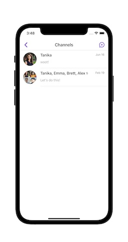
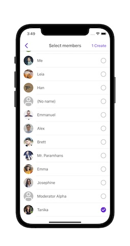
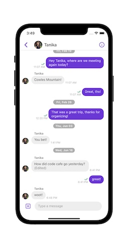

# Sendbird UIKit for iOS SwiftUI Demo

## Introduction
This sample app demonstrates how to integrate Sendbird's UIKit to a SwiftUI project.

 

 

## Requirements

* An active Sendbird application with at least two users. See [this introductory video](https://www.youtube.com/watch?v=QCS0eyO2Q3U) for instructions on how to create a new application and users.

* See the official [Sendbird UIKit for iOS](https://github.com/sendbird/sendbird-uikit-ios-sources) repo for current Xcode and iOS version requirements and instructions for adding the SDK dependency.

 

## Getting started

This sample consists of the following:

* Initializing and connecting to Sendbird 
* Presenting an instance of SBUChannelListViewController to display a list of available channels, creating and deleting channels, sending and/or editing messages in a channel.

To run:

1. Either download or clone this repository
1. Open the `ContentView.swift` file in XCode
1. Replace the application and user id with your [Sendbird application](https://dashboard.sendbird.com/) information
1. Build & run to a device or simulator.

 

## Getting Help
Check out the Official [Sendbird iOS UIKit docs](https://sendbird.com/docs/uikit/v1/ios/guides/authentication?&utm_source=github&utm_medium=referral&utm_campaign=repo&utm_content=sendbird-uikit-swift-sample) for more information. If you need any help in resolving any issues or have questions, visit our [community forums](https://community.sendbird.com/c/sendbird-chat-uikit/34?&utm_source=github&utm_medium=referral&utm_campaign=repo&utm_content=sendbird-uikit-swift-sample).

 

## We are Hiring!
Sendbird is made up of a diverse group of humble, friendly, and hardworking individuals united by a shared purpose to build the next generation of mobile & social technologies. Join our team remotely or at one of our locations in San Mateo, Seoul, New York, London, and Singapore. More information on a [careers page](https://sendbird.com/careers?&utm_source=github&utm_medium=referral&utm_campaign=repo&utm_content=sendbird-uikit-swift-sample).